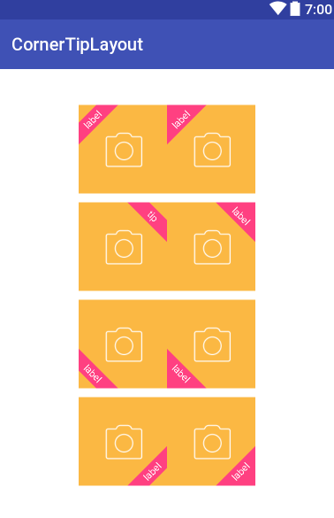

# CornerTipLayout
倾斜的角落提示标签View



### 配置项
```
    tip_corner_position: 展示位置，默认左上角
    tip_start_dis_x: x方向上起始点与所在角落的距离，默认20dp
    tip_text_v_padding: 字在梯形内的上下间距，默认3dp
    tip_background: 提示梯形的背景色，默认透明色
    tip_text_color: 提示梯形的字的颜色，默认白色
    tip_text_size: 提示梯形的字的大小，默认11sp
    tip_text: 提示文本
    
```

### 使用
#### 方式1. 在布局中加入组件:
~~~xml
    <com.zhqchen.cornertipview.CornerTipView
                xmlns:android="http://schemas.android.com/apk/res/android"
                android:layout_width="100dp"
                android:layout_height="100dp"
                android:background="@mipmap/app_btn_camera_normal"
                app:tip_corner_position="top_left"
                app:tip_text="label"
                app:tip_background="@color/colorAccent"/>
~~~

#### 方式2. 代码设置:
~~~java
    CornerTipView cornerTipView = new CornerTipView(this);
    cornerTipView.setTipCornerPosition(CornerTipView.TIP_POSITION_TOP_LEFT);
    cornerTipView.setTipBackgroundColor(Color.RED);
    cornerTipView.setTipContent("tip");
~~~

### License

	Copyright 2017 Zhq Chen

	Licensed under the Apache License, Version 2.0 (the "License");	you may not use this file except in compliance with the License.
	You may obtain a copy of the License at

		http://www.apache.org/licenses/LICENSE-2.0

	Unless required by applicable law or agreed to in writing, software
	distributed under the License is distributed on an "AS IS" BASIS,
	WITHOUT WARRANTIES OR CONDITIONS OF ANY KIND, either express or implied.
	See the License for the specific language governing permissions and
	limitations under the License.